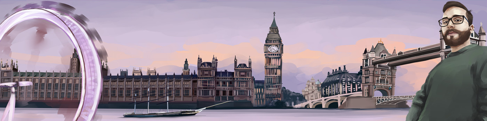

# Hello, wanderer... 

<a href="https://www.buonerba.dev"></a>

<p align="center"><a href="https://twitter.com/Dieman_"></a> <a href="https://www.linkedin.com/in/buonerba/"></a>
<a href="https://dev.to/dieman"></a>
</p>
<p>I'm Alessandro, Software Engineer from  <b>Naples, Italy</b> currently living in  <b>London, United Kingdom</b>.</p>
<p>I am currently working for <a href="https://www.kaluza.com/"><b>Kaluza</b></a> and I am a maintainer at <a href="https://blitzjs.com/"><b>Blitz.js</b></a>. You can find me on the official <a href="https://discord.blitzjs.com/">Discord</a>.</p>
<br>
<details>
  <summary>⚡ <b>Recent Activity</b></summary>
  
<!--START_SECTION:activity-->
1. 🗣 Commented on [#234](https://github.com/pankod/superplate/issues/234) in [pankod/superplate](https://github.com/pankod/superplate)
2. ❗️ Opened issue [#7](https://github.com/blitz-js/it.blitzjs.com/issues/7) in [blitz-js/it.blitzjs.com](https://github.com/blitz-js/it.blitzjs.com)
3. 🎉 Merged PR [#6](https://github.com/blitz-js/it.blitzjs.com/pull/6) in [blitz-js/it.blitzjs.com](https://github.com/blitz-js/it.blitzjs.com)
<!--END_SECTION:activity-->

</details>

<details>
  <summary>📕 <b>Latest Posts</b></summary>

<!-- BLOG-POST-LIST:START -->
- [How I set up my Mac](https://dev.to/dieman/how-i-set-up-my-mac-9m4)
<!-- BLOG-POST-LIST:END -->

</details>
<br>
<p>
  
  
  
  
  
</p>

📊 **Weekly development breakdown** 

[](https://wakatime.com/@6ee6c608-069f-4ebc-993e-39673e6cb7cf)

<!--START_SECTION:waka-->

```text
Other       10 hrs 20 mins  ███████████████████████▓░   94.85 %
```

<!--END_SECTION:waka-->
